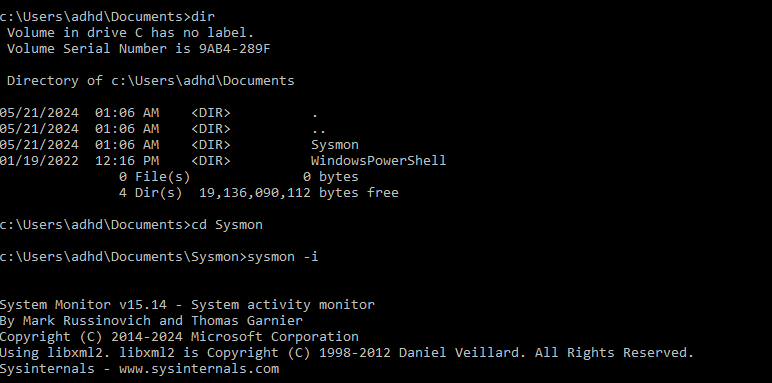
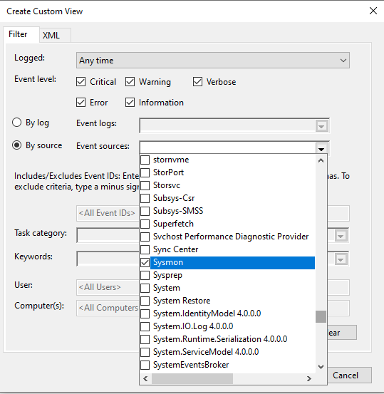
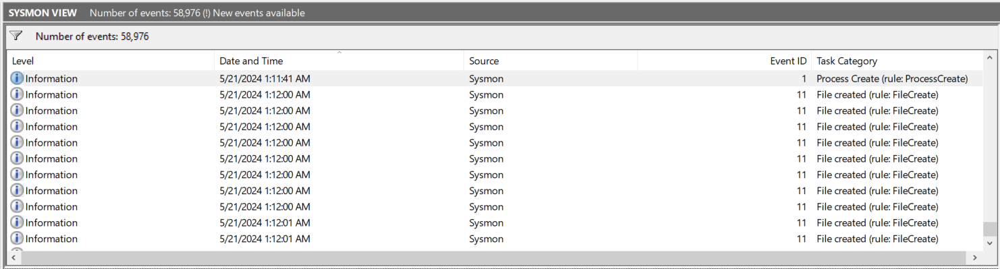

# Installing SYSMON

**SYSMON** is a windows utility and system service that once installed on a system, acts as an agent, monitoring and logging all event of that host machine to the Windows Event Log. By collecting these events, we can aggregate this information with a SIEM to analyze and identify malicious or anomalous activity.

- Logs process creation with full command line for both current and parent processes.
- Include a session GUID in each event to allow correlation of events on the same logon session.
- Logs loading of drivers or DLLs with their signatures and hashes.
- Optionally logs network connections, including each connection’s source process, IP addresses, port numbers, hostnames, and port names.
- Detects changes in file creation time to understand when a file was really created. Modification of file create timestamps is a technique commonly used by malware to cover its tracks.
- Rule filtering to include or exclude certain events dynamically.

While being similar in its intention to the standard utility -- Windows Event Logs -- SYSMON has a nicer format, allowing tons of additional information to be logged in comparison.

## Installing SYSMON 

1. Download **Sysmon** from the Sysinternals website [here](https://download.sysinternals.com/files/Sysmon.zip). Once you’ve extracted the folder within the Zip file, open a command prompt as administrator (Windows search bar > CMD > Right-click > Run as Administrator) and move to the location of the executable files. Use the command `sysmon -i` to begin the install, and click Agree when the EULA pops up.

2. Once installed, open Event Viewer and create a custom view. This will be to specifically view the events logged by SYSMON

We can now aggregate this information into a SIEM to provide additional details. However, we must note that SYSMON tends to provide very broad information. To mitigate this issue, we can implement SYSMON configuration files allowing analysts to focus on the logs that they really want to monitor.

