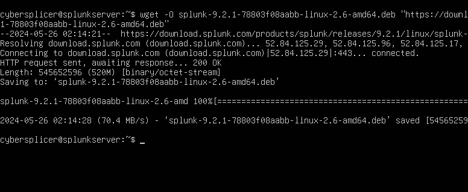
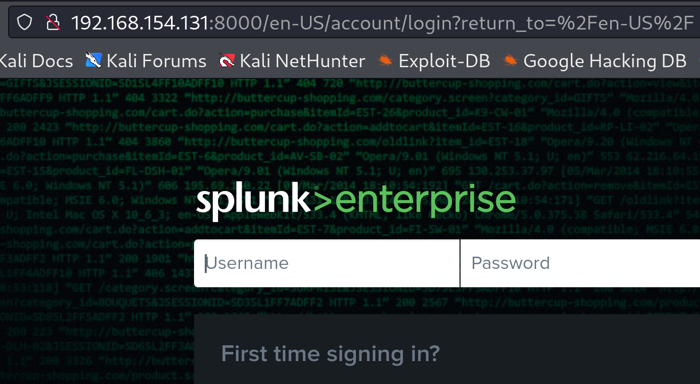

# Installing Splunk on Ubuntu Server

## Download via Command Line

1. **Copy** `wget` **link and paste into the Ubuntu Server command line.**

## Install Splunk

1. **Run the** `dpkg` **installer with the Splunk Enterprise Debian package name as an argument.**  
    
    `dpkg -i splunk_package_name.deb`

## Configure UFW (Firewall)

1. **Allow the operation of OpenSSH.**

	`sudo ufw allow openSSH`

2. **Allow and open the operation for port 8000.**

	`sudo ufw allow 8000`

3. **Enable UFW access**.

	`sudo ufw enable`

4. **Identify the status of UFW.**

	`sudo ufw status`

## Starting Splunk and Enable access

1. **Use the Splunk Enterprise command-line interface (CLI): ** 
    
    `cd //opt/splunk/bin
    `sudo ./splunk start`
    
2. **Create the Splunk Enterprise admin username and password.** This is the user that you log into Splunk Enterprise with, not the user that you use to log into your machine or onto Splunk.com. You can press Enter to use the default username of `admin`.

3. **Configure Splunk to start at boot time.**

	`sudo /opt/splunk/bin/splunk enable boot-start`

       
4. **Identify the IP Address for Ubuntu Server.**

	`ip a`

## Launch Splunk Web

With a supported web browser, navigate to:

`http://<host name or ip address>:8000`

Use whatever host and port you chose during installation.

