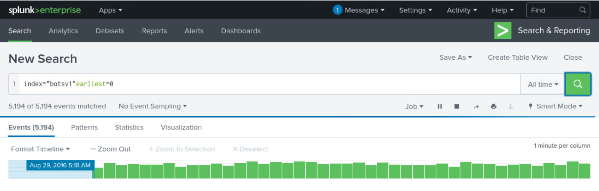
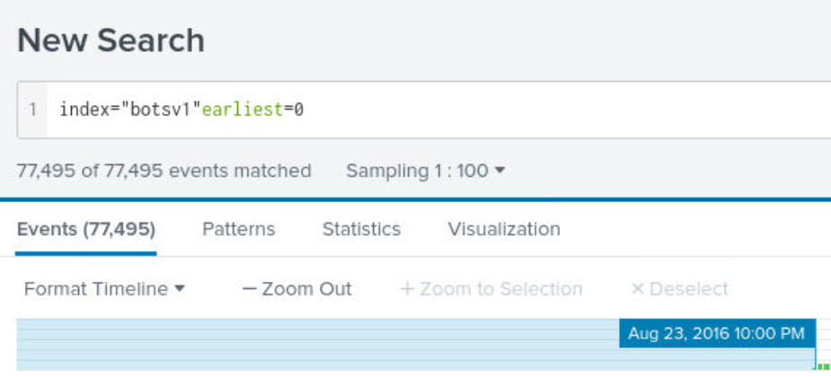
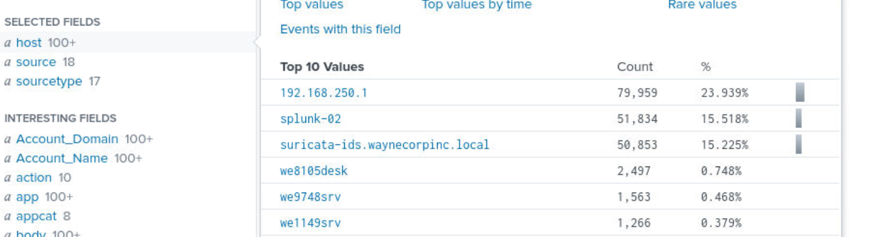
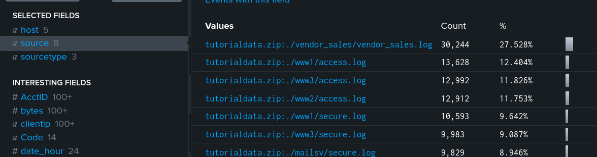
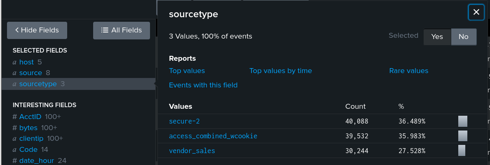
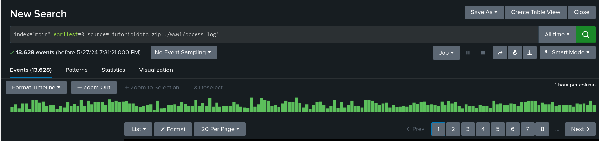
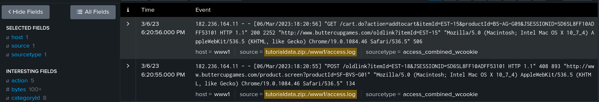

# Searching for Queries in Splunk

We can combine text strings, file names, process names, IP addresses, operators and lots more to look for specific data in our index. We believe the best way to teach you about search queries is to just jump in and go through some examples together. We’re going to cover:

- **Searching With Fields** (Selected Fields, Interesting Fields)
- **Field / Value Pairs** (AND, OR, NOT operators)
- **Wildcards**
- **Processes** (Sysmon Image field)


## Searching with Fields

1. **Enter a query.**
We can search through data by navigating  to the Search and Reporting App on the Splunk homepage.
In this particular instance, we have imported the BOTSv1 dataset. We can begin our search by entering the search query -- `index="botsv1" earliest=0`



This argument tells Splunk to start searching at the beginning of the dataset. Otherwise, we'll have to adjust the date range on the far left to *All time*.

2. **Apply a sample to the query.**
If the dataset contains thousands of events, we can make things a bit more simpler by changing the sampling value. Under the search bar to the left, change the value from *No Event Sampling to 1:100.*



This will show 1 out of every 100 events. Unfortunately, we will miss events. However, this will allow us to fine tune our search query then turn event sampling off.

3. **Identifying the Selected Fields and Interesting Fields.**
On the left side of Splunk we can see the *Selected Fields* and *Interesting Fields*. This information has been extracted from the raw data and sorted per our query above.


For instance, clicking on fields such as host, source and sourcetype will display the top ten values of that field. 

**Host** - These are essentially all the hosts reporting in our environment. Let's think of mail and web servers. Also, we can also include any other host machines that may generate any events as well.

**Source** - This data type details where the data is coming from specifically instead of the machine. For instance, let's consider windows event logs or any other log type that document events. 



**Sourcetype** - Now we're digging a little more deeper here. Sourcetype considers the same type across the whole environment instead of one particular source or machine.



If we wanted to wanted include one of these types in our search, all we have to do is click on any of the links and Splunk will change our query. 

This can be a great way to find specific information quickly. If we wanted to check logs from a firewall or any other security appliance, we can simply select that data type. 

**Example:** *Access log retrieval from Web server*





This particular access web log displays all the http request to the server. Now... having this information at our disposal, we can dig a little deeper and analyze the communication to client machines.


## Field / Value Pairs

In our previous example, we included a new value in our query:

`source="./www1access.log"`

This is considered a field/value pair. Here's another example:

`search src="182.236.164.11"`


## Wildcards


What is a wildcard? A wildcard operator is the asterisk character `(*)` that can be used to mean **anything**. To explain what we mean, let’s go through another example. Security analysts determine that the host 10.10.10.73 has been compromised by a malicious actor, and that the next likely step in their plan is to search for other systems in that network (10.10.10.0/24). Using Splunk, we could see if the infected host has communicated with any of the other hosts using the query:

```plaintext
search src="10.10.10.73" dst="10.10.10.*"
```

  
In the above example, the wildcard `dst=10.10.10.*` is being used to represent any IP address that begins with “10.10.10.”. We could also use this to look for words that may have different versions, such as “pass” and “password”. For example, we could search for logs that contain information about login failures with the following:

```plaintext
search pass* AND fail*
```

  
So with this query, it will return any logs that contain the following:

- “pass” “fail”
- “password” “fail”
- “pass” “failure”
- “password” “failure”


## Searching for Processes

`index="botsv1" earliest=0 Image="*\\cmd.exe" | stats values(CommandLine) by host`

The above search query  is used to investigate hosts which initiated command using *cmd.exe*. Why?
This will give the analyst an opportunity to evaluate systems where malicious activity may have executed. Identifying these commands can provide a clear picture of the scope of the issue and provide root cause analysis. Let's break this down further:

Sure, let's break down the Splunk search query `index="botsv1" earliest=0 Image="*\\cmd.exe" | stats values(CommandLine) by host` step by step:

### Components of the Query

1. **index="botsv1"**:
   - **index**: This specifies which index to search within Splunk. In this case, it is `botsv1`.
   - **"botsv1"**: The name of the index where the data is stored.

2. **earliest=0**:
   - **earliest**: This sets the earliest time boundary for the search.
   - **0**: This specifies the start of the UNIX epoch time (January 1, 1970). Essentially, this means the search will include all events from the earliest possible time.

3. **Image="*\\cmd.exe"**:
   - **Image**: This field is likely referring to the name of the executable image (process) in the logs.
   - **"*\\cmd.exe"**: The search is looking for any occurrences of `cmd.exe` (the Windows command prompt executable). The `*\\` before `cmd.exe` allows for any preceding path, ensuring that the search will match `cmd.exe` regardless of its directory.

4. **|**:
   - The pipe symbol `|` is used to chain commands together. In this case, it is used to pass the results of the search to the `stats` command.

5. **stats values(CommandLine) by host**:
   - **stats**: This command is used to generate summary statistics of the search results.
   - **values(CommandLine)**: This specifies that the command should list all unique values of the `CommandLine` field. The `CommandLine` field likely contains the full command line strings that were executed.
   - **by host**: This indicates that the statistics should be grouped by the `host` field, which typically represents the name or IP address of the machine where the event was logged.

### Purpose of the Query

The query is designed to achieve the following:
- **Search in the "botsv1" index**: It searches through the `botsv1` index for relevant data.
- **Include all time periods**: By setting `earliest=0`, it includes events from the beginning of recorded time in Splunk.
- **Find specific process executions**: It filters the search to include only events where the `Image` field matches any path ending with `cmd.exe`.
- **Aggregate and summarize command lines**: It then uses the `stats` command to collect all unique command line strings (`CommandLine` field) associated with `cmd.exe` executions.
- **Group results by host**: Finally, it groups these command lines by the `host` field, providing a breakdown of what command lines were executed on each host.

### SYSMON

Our output has been generated essentially by the event logs from SYSMON in our environment. The *"image field"* refers to the full path of the executable file that was logged in the events of our Windows system.

#### Practical Example

Imagine you have several hosts and you want to see all command prompt commands executed across these hosts. The Sysmon logs would include entries like:

```
EventID: 1 (Process Creation)
TimeCreated: 2024-05-26T15:38:06.621268-0600
Image: C:\Windows\System32\cmd.exe
CommandLine: cmd.exe /c "dir C:\"
Host: host1

EventID: 1 (Process Creation)
TimeCreated: 2024-05-26T16:38:06.621268-0600
Image: C:\Windows\SysWOW64\cmd.exe
CommandLine: cmd.exe /c "ipconfig"
Host: host2
```

When the query is executed, it will filter these events to include only those where the `Image` field ends with `cmd.exe`. The `stats` command then aggregates the command lines for each host, producing an output like:

```
host        values(CommandLine)
----        -------------------
host1       ["cmd.exe /c \"dir C:\\\""]
host2       ["cmd.exe /c \"ipconfig\""]


```

### Example Output

The result of this query will be a table with two columns:
- **host**: The name or IP address of each host where `cmd.exe` was executed.
- **values(CommandLine)**: A list of unique command line strings that were executed on each host.

**Example:**
```
host        values(CommandLine)
----        -------------------
host1       ["C:\\Windows\\System32\\cmd.exe /c dir", "C:\\Windows\\System32\\cmd.exe /c whoami"]
host2       ["C:\\Windows\\System32\\cmd.exe /c ipconfig", "C:\\Windows\\System32\\cmd.exe /c netstat"]
```

In this example, `host1` and `host2` are two different machines, and the query has identified and listed the unique command lines that were executed on each.

For instance, we can clearly see in this example that cmd.exe executed in the system32 folder. This folder is sensitive as it handles the majority of the host machines system files. Additionally, we can identify that multiple command were issued including moving system files and detonating a possible malicious executive file.

### Summary

This query is used to investigate which command lines involving `cmd.exe` were executed on different hosts in the `botsv1` index. It provides a clear view of command execution patterns across various machines, which can be particularly useful for security investigations to identify suspicious or malicious activity.


`metadata type=sourcetype | fields sourcetype`