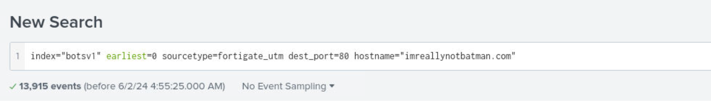
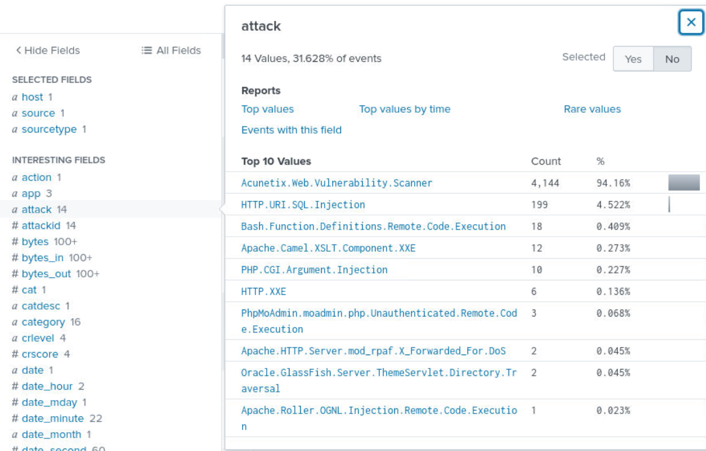
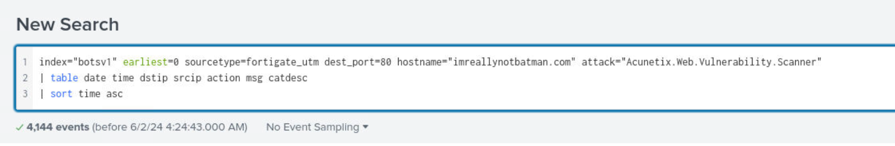
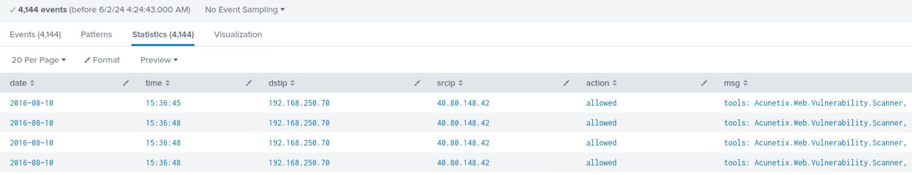
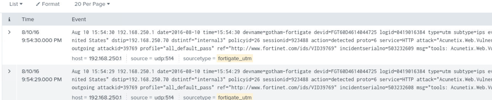

# Splunk Investigation 2

## **Investigation Scenario**

Our website has shown signs of high resource usage, but it doesn't look like a distributed denial-of-service attack, because the request are coming from one single IP address. They seem to be performing a port scan and trying to access different resources on the website - it could be a vulnerability scanner. We need you to investigate and gather information about this activity, include where it's coming from, what tool are they using, and the resources they have accessed. We run routine checks, but if they find something we haven't seen before, this could get bad really quick.

Instead of looking through thousands of web logs we can look at logs from the FortiGate firewall, specifically the Unified Threat Management solution, so make sure to set your sourcetype as fortigate_utm. You should search for our domain name as a string, "imreallynotbatman.com" and the string "vulnerability" to find events related to this activity.

## Identify the 5 W's of the incident.

- Who were the victims, attackers of the compromise? *Website* - *iamnotbatman.com*
- What happened? *High Resource Usage, requests coming in from one location*
- When did it happen? *Date and time*
- Where did it happen? *Company Website*
- Why did it happen? *To be determined

## Identify the sourcetype available in our SIEM (Splunk). 
- IDS
- UTM
- FIREWALL
- HTTP STREAM
- WINDOWS EVENT LOGS AND SYSMON
- SERVERS

To access our situation, we need to retrieve relevant information from one or two of these sources. Since we are trying to identify network traffic, It's probably best to start at our firewall or UTM. With our some of our identifiable artifacts at hand ( *domain, date and time, etc..*), we can discern and identify more to fully tell the story of what's going on.

## Prepare Search Query

Our first step is to create a search query to parse the logs in the FortiGate Firewall. Let's use these initial data types to begin with:
- *index="botsv1"*
- *sourcetype=fortigate_utm*
- *hostname="iamreallynotbatman"* OR *url_domain="iamreallynotbatman"*

Additionally, we can add some interesting fields to our search such as *port and attack type*. This should narrow our search a bit to find the culprit of the origin of the scan.

As we can see, there are many attack values available to search within our dataset. For our purposes, we are only interested in learning the origin of the vulnerability scan. If we select that value, we can enter that into our search query as well.

We can also create a table with our search to display the data we're ultimately interested in. For example, I've chosen to display the *date, time, dstip, srcip, action, and msg* categories in our search.

Our results are displayed below in ascending order.

**Table example:**

**Events example:**

**Question 1 )**  
**What is the name of the web vulnerability scanner that is being used?**  
*Acunetix*

**Question 2 )**  
What is the source IP of the vulnerability scanner, and therefore the attacker?
*40.80.148.42*

**Question 3 )**  
What is the destination IP? (the internal address for our web server)
*192.168.250.70*

**Question 4 )**  
FortiGate UTM provides enrichment, and can tell us the source IP country based on a lookup. What country is the scanning IP associated with?
*United States*

**Question 5 )**  
What is the log 'time' field value for the first FortiGate UTM log referencing the vulnerability scan, on 8/10/16, in the format HH:MM:SS? (Use Sort!)
*15:36:45*

