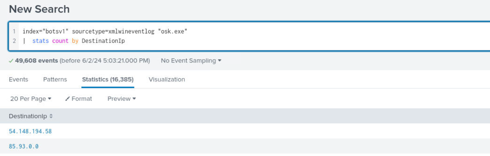
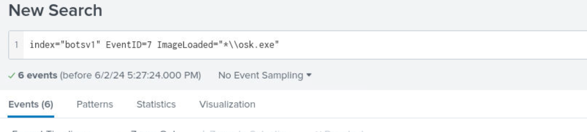
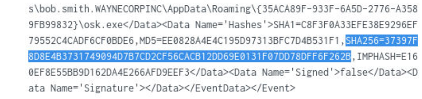
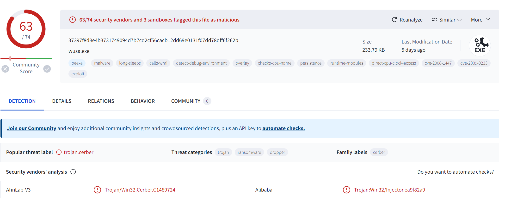
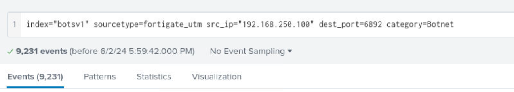
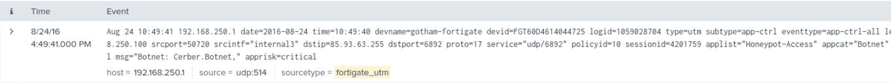

# Splunk Investigation 3

## **Investigation Scenario**

One of our IT technicians has reported an unexpected file in the registry of an employee they were assisting. You have been tasked with investigating using various log sources and OSINT to understand if the file is legitimate or malicious, and what it is doing.

## Identify the 5 W's of the incident.

- Who were the victims, attackers of the compromise? *Employee
- What happened? *Unexpected file identified in registry of an employee we were assisting -osk.exe*
- When did it happen? *To be determined*
- Where did it happen? *Company computer of an employee*
- Why did it happen? *To be determined

# What is osk.exe?

The genuine osk.exe file is a software component of _Microsoft Windows Operating System_ by _Microsoft Corporation_.  
"OSK.exe" is Microsoft's On-Screen Keyboard, part of its Ease of Use options for users with disabilities. Introduced in Windows 7, it remains available in Windows 8.1 and 10, although each version has changed how to turn it on. It resides in "`C:\Windows\System32`". On 64-bit systems there are two versions with the same name, with the one in "`C:\Windows\SysWoW64`" allowing interaction with 32-bit apps. It is not the same as the Touch Keyboard in "TabTip.exe" and "TabTip32.exe". (Some online articles and forum posts equate or confuse them.) *It presents a virtual keyboard layout in an actual resizable window on the screen*. It allows hovering, scanning, or clicking with a mouse or game joystick to select and activate keys, but not touch. It offers features the Touch Keyboard lacks, including 101-key, 102-key, and 106-key layouts. It is convenient for users but developers trying to make code interact with it often report problems.

## Identify the sourcetype available in our SIEM (Splunk). 
- IDS
- UTM
- FIREWALL
- HTTP STREAM
- WINDOWS EVENT LOGS AND SYSMON
- SERVERS

**Question 1 )**  
OSINT can be extremely useful in almost every investigation. Perform a Google search for osk.exe - what is the full name of the Windows feature associated with osk.exe?
*On-Screen Keyboard*

**Question 2 )**  
Continue with your OSINT research. What is the expected file path for osk.exe? (Path to the folder, or full file paths are accepted)
*C:\Windows\System32*

**Question 3 )**  
Filter on **Sysmon** events (**sourcetype=xmlwineventlog**) and search for the suspicious executable name. How many events are returned based on this query?
*49608*

**Question 4 )**  
What is the full file path of the suspicious executable?
*C:\Users\bob.smith.WAYNECORPINC\AppData\Roaming\{35ACA89F-933F-6A5D-2776-A3589FB99832}\osk.exe*

**Question 5 )**  
What computer is the suspicious file running on, what is the internal IP address, and which user account is running it?  
Format: ComputerName, X.X.X.X, User.Account
*we8105desk.waynecorpinc.local,192.168.250.100, bob.smith*

**Question 6 )**  
To scope our next searches only on this executable, find an appropriate field + value pair to add to your search query. Next it's a good idea to see if there are any network connections - what destination ports is this file connecting to?  
Format: Port, Port
*6892, 80*

**Question 7 )**  
Adding the destination port with the highest activity to your query, use 'stats count' functionality to identify the number of unique destination IP addresses this file is connecting to  
Format: Number of Destination IPs
*16385*

**Question 8 )**  
Sysmon EventID 7 logs contain the hash values of files (ImageLoaded field) that are executed. Use this to find the SHA256 hash of the suspicious osk.exe and submit it  
Format: SHA256 Hash of Suspicious osk.exe
*37397F8D8E4B3731749094D7B7CD2CF56CACB12DD69E0131F07DD78DFF6F262B*

**Question 9 )**  
Outside of the lab, submit the SHA256 hash to VirusTotal. Based on the results on the Detection page, what is the potential name of this malware?  
Format: Individual Malware Name
*Cerber

**Question 10 )**  
Sysmon was useful, but let's investigate the network traffic coming from the suspicious file out to thousands of IP addresses. To do this we'll look at the Fortigate Unified Threat Management logs. Find something all (but one) of the osk.exe sysmon logs have in common regarding network traffic and use this in your search query. What is the category of malware dedicated by Fortigate?  
Format: Malware Category
*Botnet*

**Question 11 )**  
What is the name given to this specific malware by Fortigate?  
Format: Individual Malware Name
*Cerber.Botnet*

**Question 12 )**  
Conduct another OSINT search for the name of the malware. What is the primary function of this malware? (Submit the malware category, different from Q10)  
Format: Primary Malware Category
*Ransomware*

**Question 13 )**  
Finally, let's investigate the single connection from osk.exe to a remote IP address on destination port 80 HTTP. Find the IP from the Sysmon logs and use it to search in the suricata logs - these logs have different event types, and we're interested in 'alert'. If Suricata has alerted on this activity, what is the alert.signature value?  
*ET POLICY Possible External IP Lookup ipinfo.io *

