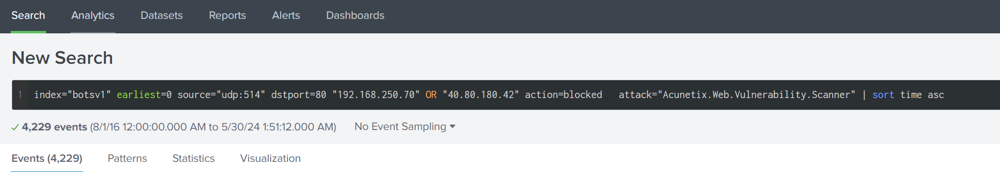
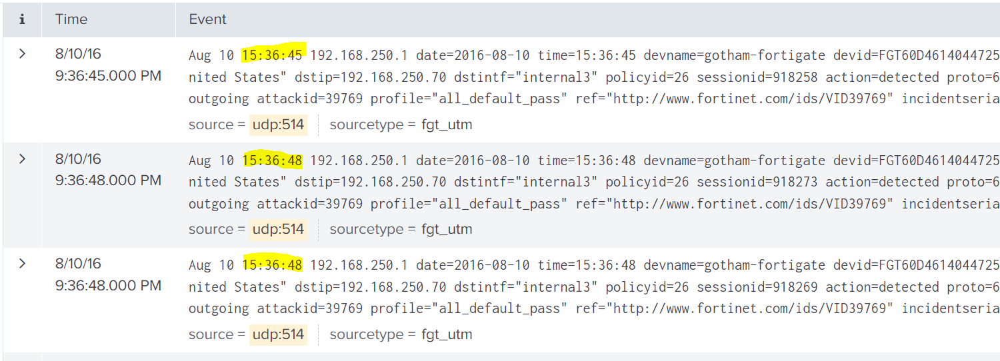
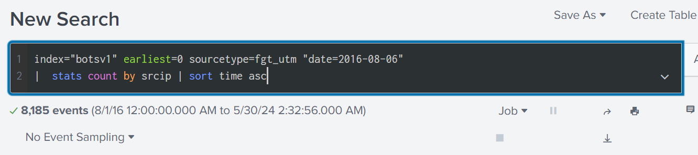
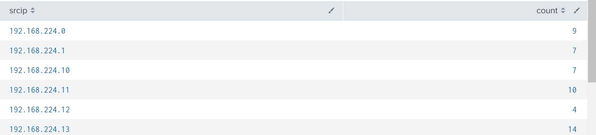
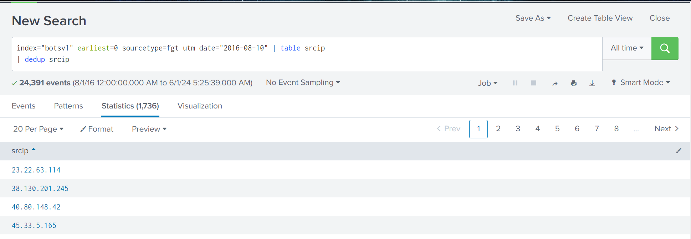

# Splunk Search Commands

- **Sort**
- **Stats**
- **Table**
- **Uniq**
- **Dedup**

## Sort
This command allows us to sort our searches in order to our liking. 

`| sort time asc`

`| sort time dsc`

`| sort limit=2 time asc`

## Stats 
This command will provide statistics about the results form our search query.

`| stats count by srcip`

`index="botsv1" sourcetype=fgt_utm "date=2016=08=10" | stats count by srcip`

## Table

We can use the table command to create a custom table of the data we want to display and hide everything else . This makes it more presentable and easier to look at the information we just care about. Also, we can use column headings for additional filtering.

`| table date, time, script, dstport, action, msg`

## Uniq/ dedup

The `uniq` command is used to retrieve unique values from our search results.

`| table srcip | uniq`

Additionally, we can utilize `dedup` to de-duplicate results in our search results.

`| table srcip | dedup srcip`

