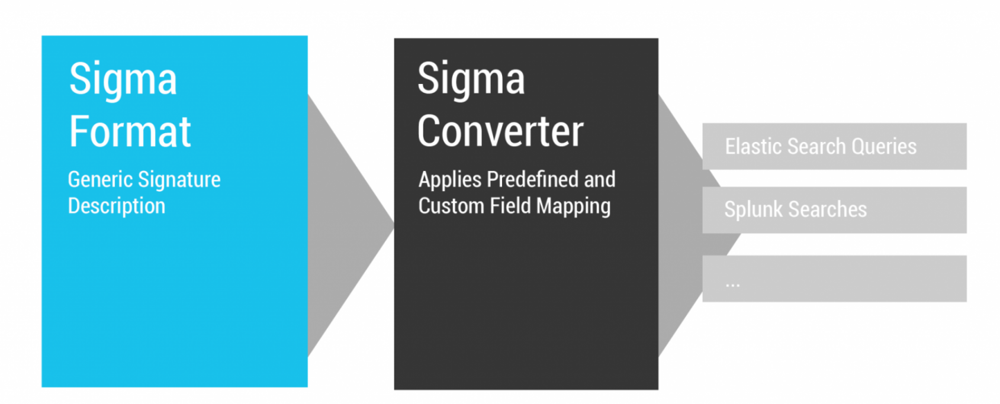

# What is Sigma?


Sigma is a generic and open signature format that allows you to describe relevant log events in a straightforward manner. The rule format is very flexible, easy to write and applicable to any type of log file.

The main purpose of this project is to provide a structured form in which researchers or analysts can describe their once developed detection methods and make them shareable with others.

Sigma is for log files what [Snort](https://www.snort.org/) is for network traffic and [YARA](https://github.com/VirusTotal/yara) is for files.




Rules are written in the Sigma language and then submitted to a converter in which they can be exported as rules in the correct format for a number of different SIEMs platforms.

**Sigma Supported Platforms**

- Splunk
- QRadar
- Arcsight
- Elasticsearch
- Logpoint

Benefits of using Sigma

- Describe the detection method to make it sharable
- Write specific SIEM searches in Sigma to avoid vendor lock-in
- Share the signature of  the analysis in the appendix of your report along with IOCs and YARA rules to allow others to replicate your work and build detection rules.

## Rule Template

```
title: a short capitalised title with less than 50 characters
id: generate one here https://www.uuidgenerator.net/version4
status: experimental
description: A description of what your rule is meant to detect 
references:
    - A list of all references that can help a reader or analyst understand the meaning of a triggered rule
tags:
    - attack.execution  # example MITRE ATT&CK category
    - attack.t1059      # example MITRE ATT&CK technique id
    - car.2014-04-003   # example CAR id
author: Michael Haag, Florian Roth, Markus Neis  # example, a list of authors
date: 2018/04/06  # Rule date
logsource:                      # important for the field mapping in predefined or your additional config files
    category: process_creation  # In this example we choose the category 'process_creation'
    product: windows            # the respective product
detection:
    selection:
        FieldName: 'StringValue'
        FieldName: IntegerValue
        FieldName|modifier: 'Value'
    condition: selection
fields:
    - fields in the log source that are important to investigate further
falsepositives:
    - describe possible false positive conditions to help the analysts in their investigation
level: one of five levels (informational, low, medium, high, critical)
```

Link to creation guide: https://github.com/SigmaHQ/sigma/wiki/Rule-Creation-Guide

