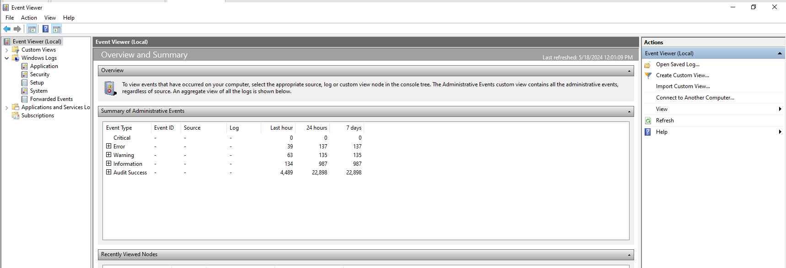
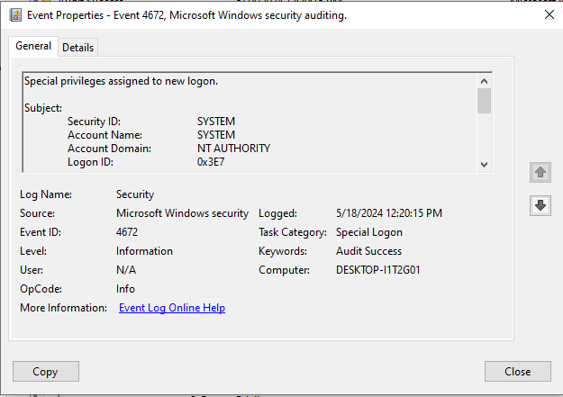

# Working with Windows Security Event Logs

These logs keep a detailed record and account of the vast majority of  events occurring on a system. 
- hardware events
- user logins
- program execution and installation, etc...

Here are how these events are categorized in Windows: 

- **Application:** Events logged by an application.
- **System:** Events logged by the Operating System (Device loading, startup errors, etc..)
- **Security:** Events that are specifically relevant to the security of the system ( Logins, file deletion, administrative permissions)
- **Directory Service:** Relegated for domain controllers -- Active Directory
- **DNS Server:** Record available only for DNS servers
- **File Replication Service:** Another record for domain controllers as it stores replication events.

## Navigating Security Logs with Event Viewer

Let's first identify what type of events are logged in Security. These elements are essentially related to the Windows Security audit Policies of the system. They allow precise control and systematic monitoring to help evaluate the security of the system:

- **Account Logon events** (valid and invalid sign-on and sign-offs)
- **Account management** (creation, modification, interaction of user accounts)
- **Privilege use**
- **Resource usage** (file creation, modification, interaction and deletion)

## Identifying Logon Events

On the left side of the panel, we'll see windows logs split into five different sections:
- Application
- Security
- Setup 
- System
- and Forwarded Events

1. If we click on Security, the middle pane will show us the most recent activity which is timestamped as well. For instance, let's highlight *event id: 5379*.

This event is actually evaluating the beginning of the logon process for a *user account -- adhd*.
*Event 5379* is related to the credential manager credentials being read to verify that the given credentials being used by adhd are valid. Additionally, we can also note that the account domain along with its security ID is identified. These specific creds were verified and approved.

2. Above the *Event ID of 5379*, are the remaining chain of events for a typical logon process -- *Logon and Special Logon*. Typically, when a user logs on to a system, the *Event ID of 4624* will usually be the only identifier of this audit. However, since the user has elevated privileges, the *Event ID of 4672 -- Special Logon* will be noted as well. User **adhd** has administrator has and these events are paired together to indicate that. Let's double click on each event to display additional information.

## Creating Custom Views 

Event viewer allows to create custom search profiles to specifically retrieve the event ids we want from the system.

1. **Open Event Viewer and click on custom views on the left-hand side.**

By default, there's already a custom view available for Administrative Events. In the right-hand side of the panel, we will find the option to create a custom view.

2. **Click "Create Custom View" to make our own filter.**

**Logged:** Allows the ability to set a range to retrieve logs by *Any time, Last Hour, Last 12 Hours, etc...*

**Note:** *This can be a useful technique to implement if the system id not connected to a SIEM, allowing analysis of a system and the ability to retrieve specific logs after an event.*

**Event Level:** Allows selection of specific event levels we want to filter.

**By Log:** We can choose what logs we want to filter.

**By Source:** Allows selection of specific areas of operating system and applications.

**Includes/Excludes Event IDs:** This section allows us to define exactly what event IDs we want to capture. We can enter in any Event IDs we want to retrieve by listing them, using a comma as a separator, *for example:* **56,991,4101,3314**

**Keywords:** We can look for specific keywords within Events. See the below screenshot for the options we can choose.

**User and Computers:** This section lets us focus on specific users or systems, if other Windows systems are pushing their event logs to the system we’re viewing Event Viewer on. If there was a user named *“KellyP”* and we only wanted to investigate events related to them, we would use their user account name in the User field.

**Example:** The following are events we need to consider for our View:

- **User Logon Successful –** 4624
- **Special Logon –** 4672
- **User Initiated Logoff –** 4647
- **User Logoff –** 4634

