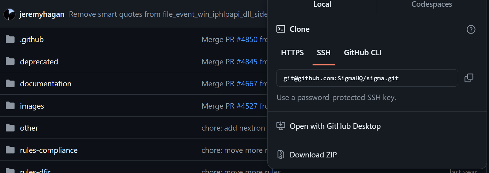
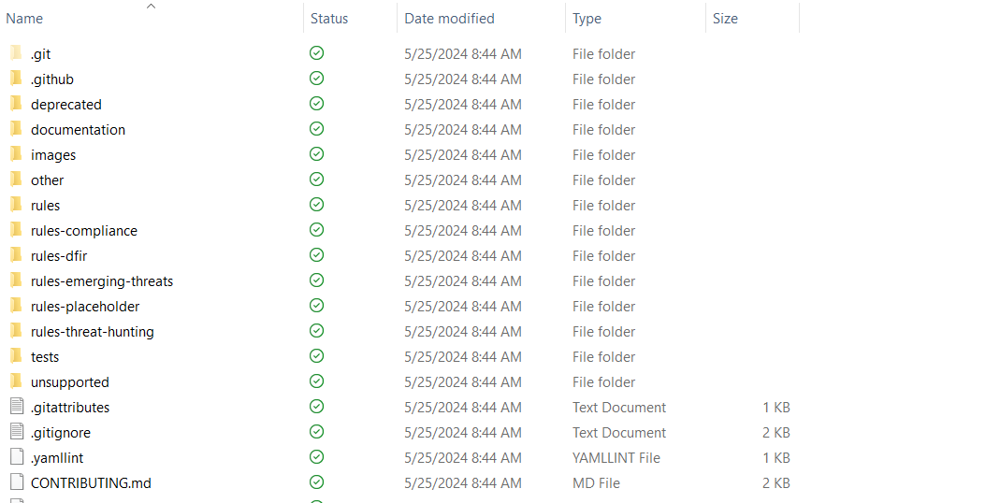
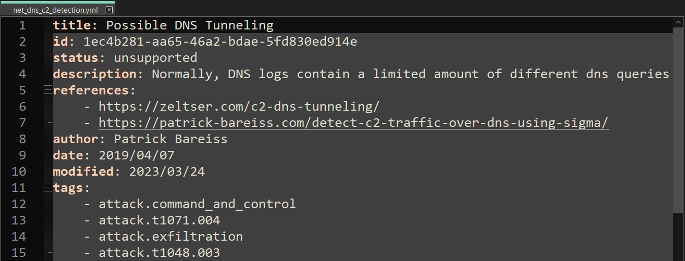

# Writing Sigma Rules

In this lab, we will write a Sigma rule to detect a new type of malware which uses DNS tunneling. This malware which we named 'TRANSPORTER', uses a command and control channel to issue out commands to infected systems. DNS packets has the ability to conceal many different types of data which makes it a perfect tool for delivering this type of traffic. 

Here are the following details of the malware: 
**Domain Name:** redhunt.net
**Average Number of Request:** 500
**MITRE ATT&CK Techniques Used:** T171.004
(Application Layer Protocol: DNS)

In this case, we can find an existing Sigma rule which closely aligns to our need and simply rewrite a new rule for the 'TRANSPORTER' malware.

1. Download the Sigma master ZIP file from GitHub. 



2. Once downloaded, extracted files into a folder. In this case, our folder will be called Sigma.



3. Go into the `unsupported\network folder` and then open up the *net_dns_c2_detection.yml* in your text editor of choice.



- **title** is a custom descriptive value that is used to provide a very brief explanation of what the rule is looking for.
- **id** is used as a unique identifier for this rule.
- **status** is a custom descriptive value used to explain the state of the rule. Some examples could include ‘incomplete’, ‘experimental’, or ‘production’.
- **description** is a custom descriptive value used to provide a more detailed explanation of what the rule is trying to detect and how.
- **author** is a custom value used to hold the author(s) of this SIGMA rule.
- **date** is a custom value used to hold the date the rule was first created.
- **modified** is a custom value used to hold the date when the rule was last edited by an author.
- **references** is a custom list that holds URLs that help to explain what the rule is trying to detect
- **logsource** is used to explain what logs are required in the SIEM for the rule to function
- **logsource category** is dns, showing that the security team will need to be pulling dns logs into their SIEM for the rule to work
- **detection** explains the logic behind the rule including conditions that, when met, can generate an alert.
- **selection** states that something must be selected from the DNS logs. In this case it’s the parent domain (or root domain, such as Google.com).
- **parent_domain** states the log field that should be selected. The * asterisk symbol represents a ‘wildcard’ meaning that any value can be used. This means that ANY domain should be selected.
- **condition** states the actual detection logic. For this rule it will retrieve all parent_domain values and count the number of queries to that domain. If the count is over 1000 (> 1000 meaning greater than 1000) then it will alert.
- **falsepositives** is a custom list that states how false positives could occur.
- **falsepositives 2** – The author explains that legitimate software that uses dns to transfer data would generate an alert, even though it is not malicious activity.
- **level** is a custom descriptive value that in this rule appears to be stating how urgent this alert should be.
- **tags** is a custom list that includes different MITRE ATT&CK techniques that can be detected using this rule.

2. Copy and create new Sigma file and rewrite rules according to our details of the malware.
```
title: DNS Tunneling - Transporter Malware

status: unsupported
description: This malware named 'TRANSPORTER', uses a command and control channel to issue out commands to infected systems. DNS packets has the ability to conceal many different types of data which makes it a perfect tool for delivering this type of traffic. 
references:
    - https://zeltser.com/c2-dns-tunneling/
  
author: Curtis Osbey
date: 2024/05/22
modified: 2024/05/22
tags:
    - attack.command_and_control
    - attack.t1071.004
    - attack.exfiltration
    - attack.t1048.003
logsource:
    category: dns
detection:
    selection:
        parent_domain: 'redhunt.net'
    condition: selection | count(dns_query) by parent_domain > 400
falsepositives:
    - Valid software, which uses dns for transferring data
level: high
```


